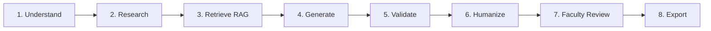

# Multi-Agent Architecture & Humanized Content Engine

## 1. Academic Assistant Orchestrator
The central orchestrator coordinates specialized sub-agents through an 8-step pipeline:

## 2. Specialized Sub-Agents
1. **Notes Generation Agent**: Generates classroom lecture notes with Learning Objectives, Core Concepts, Realistic Case Studies, Mermaid diagrams, Exam Points, and Common Student Misconceptions.
2. **Question Paper Multi-Set Agent**: Produces 1 to 10 balanced question paper sets with 100% zero cross-set duplicate questions, exact 100-mark validation, and cognitive difficulty distribution sliders.
3. **Answer Key & Rubric Agent**: Generates step-by-step marking schemes with specific mark allocations per definition, diagram, derivation, and example.
4. **Diagram Agent**: Generates verified, valid Mermaid.js diagrams for network protocols, database normalizations, ML pipelines, and algorithms.
5. **Research & Citation Agent**: Gathers verified references from IEEE, MDN, W3Schools, and standard textbooks without hallucinating fictitious literature.
6. **Exam Trend Analysis Agent**: Evaluates historical previous year examination papers to provide topic weightages and recurring concept patterns with explicit disclaimers.

## 3. Humanization & Anti-Cliché Rules
- Completely eliminates boilerplate AI phrases such as *"In today's world..."*, *"It is important to note that..."*, *"As an AI language model..."*.
- Implements the natural pedagogical tone of an experienced university professor delivering a classroom lecture.
